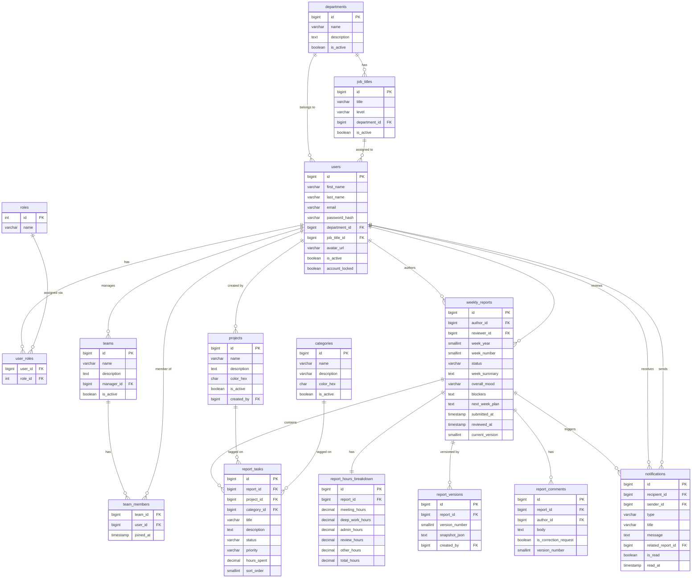

# Weekly Report Generator & Team Dashboard

An internal productivity and accountability platform that replaces ad-hoc status updates (Slack messages, spreadsheets, email threads) with a structured, auditable, role-aware system for capturing, reviewing, and analyzing weekly work activity.

---

## Table of Contents

- [Features](#features)
- [Tech Stack](#tech-stack)
- [Architecture](#architecture)
- [User Roles](#user-roles)
- [Getting Started](#getting-started)
- [Seed Data](#seed-data)
- [API Overview](#api-overview)
- [Report Lifecycle](#report-lifecycle)
- [Database](#database)
- [Project Structure](#project-structure)

---

## Features

- **Structured weekly reports** — fixed-format forms with tasks, hours breakdown, mood, blockers, and next-week plans
- **Review workflow** — DRAFT → SUBMITTED → APPROVED / NEEDS_CORRECTION state machine
- **Version history** — full JSON snapshots saved on every resubmission after correction
- **Team dashboard** — manager view with filters by week, member, status, and project; KPI cards and charts
- **Personal dashboard** — hours trend, project distribution donut, mood over time, task completion rate
- **Projects & categories** — CRUD management with soft-deactivation
- **Department & job title management** — normalized org structure with level classification
- **Notifications** — in-app notifications triggered on report state transitions
- **AI chat assistant** — endpoint wired and stubbed, ready for LLM integration in v1.1
- **RBAC** — every API endpoint enforced via Spring Security `@PreAuthorize`

---

## Tech Stack

### Backend
| | |
|---|---|
| Java 17 | Spring Boot 4.x |
| Spring Security 6 | JWT (jjwt 0.12.6) |
| Spring Data JPA + Hibernate | PostgreSQL 16 |
| Flyway | Lombok |

### Frontend
| | |
|---|---|
| React 19 | TypeScript |
| Vite | Tailwind CSS v4 |
| shadcn/ui + Radix UI | Redux Toolkit 2.x |
| Recharts | React Hook Form + Zod |
| Axios | React Router 7 |

### Infrastructure
| | |
|---|---|
| Docker + Docker Compose | Mailpit (local email) |

---

## Architecture

```
React SPA (Vite)
      │  JWT in Authorization header
      ▼
Spring Boot 4.x
  ├── Spring Security filter chain (CorsFilter → JwtAuthFilter → AuthzFilter)
  ├── REST Controllers
  ├── Service layer
  └── Repository layer (JPA)
      │
      ▼
PostgreSQL 16
```

---

## User Roles

| Role | Description |
|------|-------------|
| `TEAM_MEMBER` | Can create and manage their own reports only |
| `MANAGER` | Can view all team reports, approve/reject, access team dashboard |
| `ADMIN` | Full access — users, teams, projects, departments, all reports |

---

## Getting Started

### Prerequisites

- Docker Desktop
- JDK 17
- Node.js 20+
- Maven 3.9+

### 1. Start the database and mail server

```bash
docker compose up -d
```

This starts:
- PostgreSQL 16 on port `5432`
- Mailpit (SMTP on `1025`, web UI at `http://localhost:8025`)

Create a `backend/.env` file with your database credentials:

```env
DB_NAME=weekly_reports_db
DB_USER=app_user
DB_PASSWORD=dev_password
```

### 2. Run the backend

```bash
cd backend
./mvnw spring-boot:run -Dspring-boot.run.profiles=dev
```

The API will be available at `http://localhost:8080`.
Swagger UI: `http://localhost:8080/swagger-ui.html`

### 3. Run the frontend

```bash
cd frontend
npm install
npm run dev
```

The app will be available at `http://localhost:5173`.

---

## Seed Data

The backend auto-seeds on first startup (idempotent — skipped if users already exist).

**Default password for all seeded users:** `SeedPass1!`

| Name | Email | Role |
|------|-------|------|
| Admin | admin@company.com | ADMIN |
| Bob Chen | bob@company.com | MANAGER |
| Alice Dev | alice@company.com | TEAM_MEMBER |
| Charlie FE | charlie@company.com | TEAM_MEMBER |
| Diana QA | diana@company.com | TEAM_MEMBER |
| Evan DevOps | evan@company.com | TEAM_MEMBER |

Seeded data also includes: 4 projects, 7 categories, 8 weeks of reports (W27–W34 2026) in varied statuses for the Platform Engineering team.

---

## API Overview

Base path: `/api/v1` — all endpoints require `Authorization: Bearer <token>` except `/auth/**`.

| Group | Endpoints |
|-------|-----------|
| Auth | `POST /auth/register`, `POST /auth/login`, `POST /auth/logout`, `GET /auth/me` |
| Reports | CRUD + `/submit`, `/approve`, `/request-correction`, `/versions`, `/comments` |
| Dashboard | `/dashboard/personal`, `/dashboard/team`, `/dashboard/admin/overview` |
| Projects | CRUD + soft-deactivate |
| Categories | CRUD |
| Teams | CRUD + member management |
| Users | CRUD + role assignment |
| Departments | CRUD + soft-deactivate |
| Job Titles | CRUD + soft-deactivate |
| Notifications | List, mark read, unread count |
| AI Chat | `POST /ai/chat` (stub response in v1.0) |

Paginated responses use: `?page=0&size=20&sort=createdAt,desc`

---

## Report Lifecycle

```
DRAFT ──[submit]──► SUBMITTED ──[approve]──► APPROVED
                        │
                   [request correction]
                        │
                        ▼
                  NEEDS_CORRECTION ──[resubmit]──► SUBMITTED
                        ▲                               │
                        └─── version snapshot saved ────┘
```

**Rules:**
- One report per user per ISO week (duplicate → 409)
- Must have at least one task before submitting
- Editing only allowed in `DRAFT` or `NEEDS_CORRECTION` status
- A full JSON snapshot is saved to `report_versions` on every resubmission after correction

---

## Database

### ER Diagram



---

### Table Schemas

#### `roles`
| Column | Type | Notes |
|--------|------|-------|
| id | `INTEGER` | PK |
| name | `VARCHAR(50)` | UNIQUE — `TEAM_MEMBER`, `MANAGER`, `ADMIN` |
| created_date | `TIMESTAMP` | |
| last_modified_date | `TIMESTAMP` | |

#### `departments`
| Column | Type | Notes |
|--------|------|-------|
| id | `BIGINT` | PK |
| name | `VARCHAR(100)` | UNIQUE |
| description | `TEXT` | nullable |
| is_active | `BOOLEAN` | default `true` |
| created_date | `TIMESTAMP` | |
| last_modified_date | `TIMESTAMP` | |

#### `job_titles`
| Column | Type | Notes |
|--------|------|-------|
| id | `BIGINT` | PK |
| title | `VARCHAR(150)` | UNIQUE |
| level | `VARCHAR(20)` | `JUNIOR`, `MID`, `SENIOR`, `LEAD`, `PRINCIPAL`, `MANAGER` |
| department_id | `BIGINT` | FK → departments, nullable |
| is_active | `BOOLEAN` | default `true` |
| created_date | `TIMESTAMP` | |
| last_modified_date | `TIMESTAMP` | |

#### `users`
| Column | Type | Notes |
|--------|------|-------|
| id | `BIGINT` | PK |
| first_name | `VARCHAR(100)` | |
| last_name | `VARCHAR(100)` | |
| email | `VARCHAR(255)` | UNIQUE |
| password_hash | `VARCHAR(255)` | BCrypt |
| department_id | `BIGINT` | FK → departments, nullable |
| job_title_id | `BIGINT` | FK → job_titles, nullable |
| avatar_url | `VARCHAR(512)` | nullable |
| is_active | `BOOLEAN` | default `true` |
| account_locked | `BOOLEAN` | default `false` |
| created_date | `TIMESTAMP` | |
| last_modified_date | `TIMESTAMP` | |

#### `user_roles` _(join table)_
| Column | Type | Notes |
|--------|------|-------|
| user_id | `BIGINT` | PK, FK → users (CASCADE) |
| role_id | `INTEGER` | PK, FK → roles (RESTRICT) |

#### `teams`
| Column | Type | Notes |
|--------|------|-------|
| id | `BIGINT` | PK |
| name | `VARCHAR(150)` | UNIQUE |
| description | `TEXT` | nullable |
| manager_id | `BIGINT` | FK → users |
| is_active | `BOOLEAN` | default `true` |
| created_date | `TIMESTAMP` | |
| last_modified_date | `TIMESTAMP` | |

#### `team_members` _(join table)_
| Column | Type | Notes |
|--------|------|-------|
| team_id | `BIGINT` | PK, FK → teams (CASCADE) |
| user_id | `BIGINT` | PK, FK → users (CASCADE) |
| joined_at | `TIMESTAMP` | default `NOW()` |

#### `projects`
| Column | Type | Notes |
|--------|------|-------|
| id | `BIGINT` | PK |
| name | `VARCHAR(200)` | UNIQUE |
| description | `TEXT` | nullable |
| color_hex | `CHAR(7)` | nullable |
| is_active | `BOOLEAN` | default `true` |
| created_by | `BIGINT` | FK → users, nullable |
| created_date | `TIMESTAMP` | |
| last_modified_date | `TIMESTAMP` | |

#### `categories`
| Column | Type | Notes |
|--------|------|-------|
| id | `BIGINT` | PK |
| name | `VARCHAR(100)` | UNIQUE |
| description | `VARCHAR(255)` | nullable |
| color_hex | `CHAR(7)` | nullable |
| is_active | `BOOLEAN` | default `true` |
| created_date | `TIMESTAMP` | |

#### `weekly_reports`
| Column | Type | Notes |
|--------|------|-------|
| id | `BIGINT` | PK |
| author_id | `BIGINT` | FK → users |
| reviewer_id | `BIGINT` | FK → users, nullable |
| week_year | `SMALLINT` | |
| week_number | `SMALLINT` | 1–53 |
| status | `VARCHAR(20)` | `DRAFT`, `SUBMITTED`, `NEEDS_CORRECTION`, `APPROVED` |
| week_summary | `TEXT` | nullable |
| overall_mood | `VARCHAR(20)` | nullable |
| blockers | `TEXT` | nullable |
| next_week_plan | `TEXT` | nullable |
| submitted_at | `TIMESTAMP` | nullable |
| reviewed_at | `TIMESTAMP` | nullable |
| current_version | `SMALLINT` | default `1` |
| created_date | `TIMESTAMP` | |
| last_modified_date | `TIMESTAMP` | |

> **Unique constraint:** `(author_id, week_year, week_number)` — one report per user per ISO week.

#### `report_tasks`
| Column | Type | Notes |
|--------|------|-------|
| id | `BIGINT` | PK |
| report_id | `BIGINT` | FK → weekly_reports (CASCADE) |
| project_id | `BIGINT` | FK → projects, nullable |
| category_id | `BIGINT` | FK → categories, nullable |
| title | `VARCHAR(300)` | |
| description | `TEXT` | nullable |
| status | `VARCHAR(20)` | `NOT_STARTED`, `IN_PROGRESS`, `COMPLETED`, `CARRIED_OVER`, `BLOCKED` |
| priority | `VARCHAR(10)` | `HIGH`, `MEDIUM`, `LOW`, nullable |
| hours_spent | `DECIMAL(5,2)` | |
| planned_pct | `DECIMAL(5,2)` | nullable |
| actual_pct | `DECIMAL(5,2)` | nullable |
| time_planned | `DECIMAL(5,2)` | nullable |
| output_deliverable | `TEXT` | nullable |
| sort_order | `SMALLINT` | default `0` |
| created_date | `TIMESTAMP` | |
| last_modified_date | `TIMESTAMP` | |

#### `report_hours_breakdown`
| Column | Type | Notes |
|--------|------|-------|
| id | `BIGINT` | PK |
| report_id | `BIGINT` | FK → weekly_reports (CASCADE), UNIQUE |
| meeting_hours | `DECIMAL(4,1)` | default `0` |
| deep_work_hours | `DECIMAL(4,1)` | default `0` |
| admin_hours | `DECIMAL(4,1)` | default `0` |
| review_hours | `DECIMAL(4,1)` | default `0` |
| other_hours | `DECIMAL(4,1)` | default `0` |
| total_hours | `DECIMAL(5,1)` | computed sum |

#### `report_versions`
| Column | Type | Notes |
|--------|------|-------|
| id | `BIGINT` | PK |
| report_id | `BIGINT` | FK → weekly_reports (CASCADE) |
| version_number | `SMALLINT` | |
| snapshot_json | `TEXT` | full report JSON at time of snapshot |
| created_by | `BIGINT` | FK → users |
| created_date | `TIMESTAMP` | |

> **Unique constraint:** `(report_id, version_number)`
> **Trigger:** saved when status transitions `NEEDS_CORRECTION → SUBMITTED`

#### `report_comments`
| Column | Type | Notes |
|--------|------|-------|
| id | `BIGINT` | PK |
| report_id | `BIGINT` | FK → weekly_reports (CASCADE) |
| author_id | `BIGINT` | FK → users |
| body | `TEXT` | |
| is_correction_request | `BOOLEAN` | default `false` |
| version_number | `SMALLINT` | nullable — which version this comment is against |
| created_date | `TIMESTAMP` | |

#### `notifications`
| Column | Type | Notes |
|--------|------|-------|
| id | `BIGINT` | PK |
| recipient_id | `BIGINT` | FK → users (CASCADE) |
| sender_id | `BIGINT` | FK → users, nullable |
| type | `VARCHAR(30)` | `REPORT_SUBMITTED`, `REPORT_APPROVED`, `REPORT_NEEDS_CORRECTION`, `SYSTEM` |
| title | `VARCHAR(200)` | |
| message | `TEXT` | nullable |
| related_report_id | `BIGINT` | FK → weekly_reports (CASCADE), nullable |
| is_read | `BOOLEAN` | default `false` |
| read_at | `TIMESTAMP` | nullable |
| created_date | `TIMESTAMP` | |

---

### Key Indexes

| Table | Indexed Columns | Purpose |
|-------|----------------|---------|
| `users` | `email` | Login lookup on every auth request |
| `weekly_reports` | `author_id` | Fetch all reports for a user |
| `weekly_reports` | `(week_year, week_number)` | Date-range filtering on dashboard |
| `weekly_reports` | `status` | Filter by status on dashboard |
| `report_tasks` | `report_id` | Fetch all tasks for a report |
| `report_tasks` | `project_id` | Cross-report project analytics |
| `report_versions` | `(report_id, version_number)` | Version history lookup |
| `notifications` | `(recipient_id, is_read)` | Unread count badge on every page load |

---

## Project Structure

```
.
├── backend/                    # Spring Boot 4.x application
│   ├── src/main/java/com/example/backend/
│   │   ├── auth/               # Authentication (register, login, logout)
│   │   ├── security/           # JwtService, JwtFilter
│   │   ├── user/               # User entity + CRUD
│   │   ├── role/               # Role entity
│   │   ├── department/         # Department + JobTitle entities
│   │   ├── team/               # Team entity + member management
│   │   ├── report/             # WeeklyReport, ReportTask, versioning, comments
│   │   ├── project/            # Project + Category entities
│   │   ├── dashboard/          # Aggregation service + DTOs
│   │   ├── notification/       # In-app notification system
│   │   ├── ai/                 # AI chat stub (v1.1 ready)
│   │   ├── common/             # Global exception handler, pagination, utils
│   │   └── seed/               # DataSeeder (roles, users, teams, reports)
│   └── pom.xml
├── frontend/                   # React 19 + Vite SPA
│   ├── src/
│   │   ├── pages/              # Route-level page components
│   │   ├── components/         # Shared UI components
│   │   └── store/              # Redux Toolkit slices
│   └── package.json
├── docker-compose.yml          # PostgreSQL + Mailpit
└── SPECIFICATION.md            # Full project specification
```